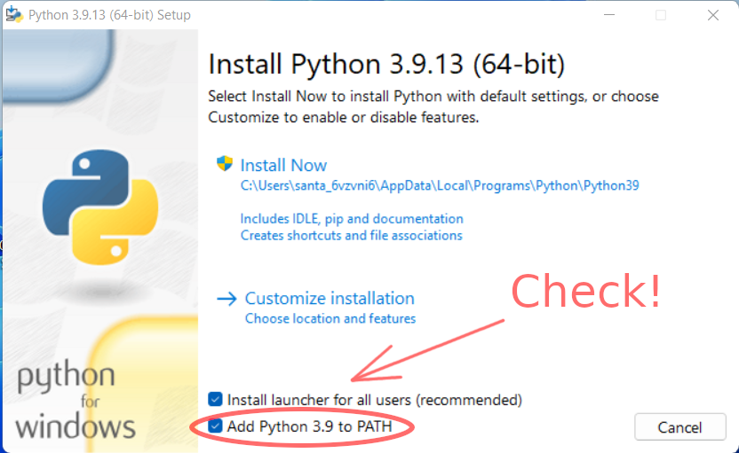
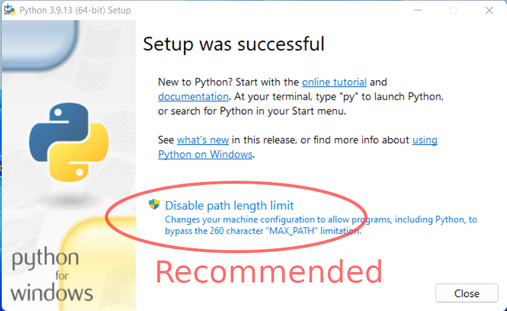

<!-- markdown-toc start - Don't edit this section. Run M-x markdown-toc-refresh-toc -->
**Table of Contents**

- [Development: Running from Source](#development-running-from-source)
    - [Linux / MacOS Setup](#linux--macos-setup)
    - [Windows Setup](#windows-setup)
        - [Install Python 3.9](#install-python-39)
        - [Install Poetry](#install-poetry)
        - [Download the Simsapa sources](#download-the-simsapa-sources)
    - [.env](#env)
    - [Editing application windows with Qt Designer](#editing-application-windows-with-qt-designer)
    - [Tests](#tests)

<!-- markdown-toc end -->

# Development: Running from Source

## Linux / MacOS Setup

- Install Python 3.9
- Install [Poetry](https://python-poetry.org/docs/)
- Clone this repo and run `poetry install` to install dependencies

In the project root, enter a venv with poetry and start the app with:

``` shell
poetry shell
./run.py
```

## Windows Setup

### Install Python 3.9

Download the [Python 3.9.13 Windows Installer](https://www.python.org/downloads/release/python-3913/), use the link marked **Recommended** at the bottom of the page.

Make sure to check **Add Python 3.9 to PATH**.



It is recommended to allow **Disable path length limit**.



Open a **cmd.exe** terminal to test:

```
python --version
Python 3.9.13
```

### Install Poetry

Open a **Powershell** terminal, copy and run the [Poetry setup script](https://python-poetry.org/docs/).

The script will print the poetry bin folder location. Open the Windows **Environment Variables** menu and add this folder to the PATH variable.

Open a **cmd.exe** terminal to test:

```
poetry --version
Poetry (version 1.2.2)
```

### Download the Simsapa sources

Git clone the simsapa repo, or click the green `[Code]` button and select `Download ZIP`.

Open a **cmd.exe** terminal, install the python libraries:

```
poetry install
```

Activate the python virtual environment with poetry, and start Simsapa:

```
poetry shell
python run.py
```

## .env

Environment variables can be set with a `.env` file is in the project root.

Recognized settings:

```
ENABLE_PRINT_LOG=true
```

Print log messages as well as writing them to `~/.local/share/simsapa/log.txt`

```
USE_TEST_DATA=true
```

Instead of connecting to database in the user's folders, connect to the test
database found in `tests/data/assets/`

```
ENABLE_WIP_FEATURES=false
```

Whether to enable work-in-progress feature which may be unstable or broken.

## Editing application windows with Qt Designer

Install Qt Designer and dependencies from the distro package manager (not `pip`).

``` shell
sudo apt-get install qttools5-dev-tools python3-pyqt5 python3-pyqt5.qtquick libqt5designer5 libqt5designercomponents5
```

Open the `.ui` file in Qt Designer, in or out- of the project venv.

``` shell
designer ./simsapa/assets/ui/dictionary_search_window.ui
```

After saving the `.ui`, re-generate the `.py` files. The Makefile target calls `pyuic5 `.

``` shell
make ui
```

Don't use the pip pacakges frequently recommended in tutorials (`pip install
pyqt5 pyqt5-tools`), these are often compiled at different Qt versions, and may
result in Qt Designer crashing with the following error:

```
...Qt/bin/designer: symbol lookup error: ...Qt/bin/designer: undefined symbol: _ZdlPvm, version Qt_5
```

## Tests

All tests:

``` shell
make tests -B
```

A single test:

``` shell
USE_TEST_DATA=true pytest -k test_dict_word_dictionary tests/test_dictionary.py
```
