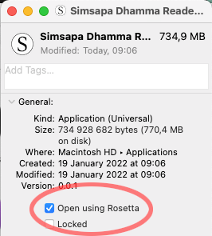

# Install on MacOS

Download the latest `.dmg.zip` from [Releases](https://github.com/simsapa/simsapa/releases/).

Extract and open the `.dmg` file.

Drag the Simsapa icon to Applications.

**Allow apps from third-party locations:**

Open System Preferences > Security & Privacy > General tab

Click on the lock icon in the bottom left and enter your admin password.

Next to the message `"Simsapa" was blocked because...`, click `Open Anyway`.

**Enable Rosetta:**

Open Finder > Applications

Right click on the Simsapa icon, and enable "Open using Rosetta"

